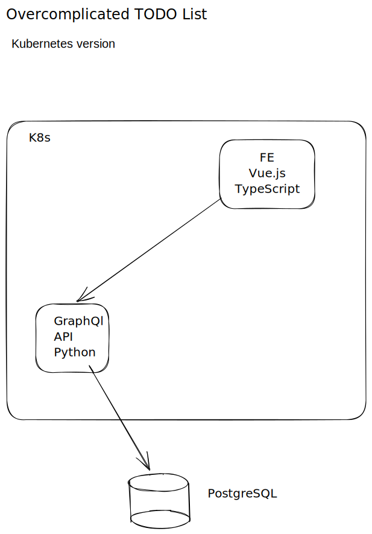
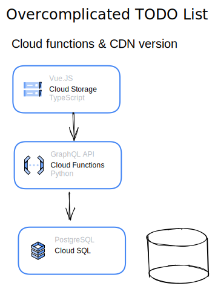

# Overcomplicated TODO list

## What is it

Is a monorepo for a To Do list web application

## Why

Why not? 🤷

Is an opportunity to learn:

- Python
- GraphQl
- SQL
- Vue.js
- TypeScript
- GitOps
- CI/CD
- Kubernetes

## How

- We will work as fullstack engineer team, picking up task/user stories from a kanban board.

- We will use conventional commits for version control.

- We will create a CI/CD pipeline to deploy in two different platforms architectures

  | Kubernetes                                               | Cloud distributed                                                 |
  | -------------------------------------------------------- | ----------------------------------------------------------------- |
  |  |  |

- We will create unit, integration and e2e tests
